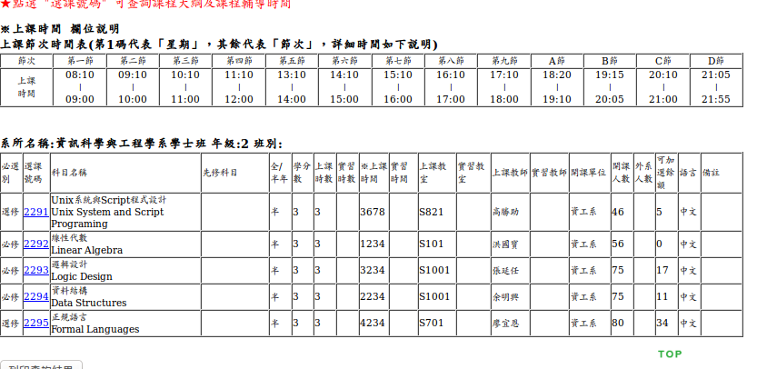
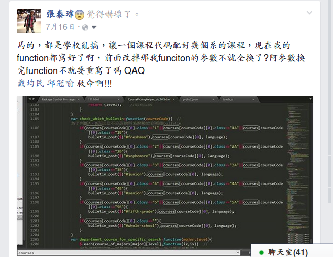

title: 選課小幫手辛酸史
author: 學生會資訊副部長 - 張泰瑋 黃翔宇

%%%%%%%%%%%%%%%%%%%
% Use '%' to comment or directive (ex:css below)

%%%%%%%%%%%%%%%%%%%
%% You can add some custom style rules here...

%css


%end

%%%%%%%%%%%%%%%%%%%
%% occupation of scale=1:
%% x = 1200
%% y = 700
%% occupation of scale=2: [occupation of scale=1] * 2
%% x = 2400
%% y = 1400
%% occupation of scale=3: [occupation of scale=1] * 3
%% x = 3600
%% y = 2100
%% occupation of scale=4: [occupation of scale=1] * 4
%% ...
%% the location of one step (slide) is originated from the center!

%%%%%%%%%%%%%%%%%%%
%% Here we go...

%%%%%%%%%%%%%%%
!SLIDE slide x=20000 y=20000

### 你有沒有覺得學校的選課**很花時間呢**？ 




%%%%%%%%%%%%%%%
!SLIDE slide x=22000 y=20000

## 我想要排通識，可是不知道什麼時候是**空堂**


%%%%%%%%%%%%%%%
!SLIDE picture x=21400 y=21600

####如果可以像這樣，把我的課表`視覺化`該多好？


%%%%%%%%%%%%%%%
!SLIDE x=29000 y=22000 scale=4

## 所以學長(妹子)就挖坑了  

>我們就傻傻的跳了....

%%%%%%%%%%%%%%%
!SLIDE x=30000 y=32000 rotate=180 scale=4

## 沒有資料要怎麼寫程式阿？

### 學校還沒有api，自己爬吧~


%%%%%%%%%%%%%%%
!SLIDE slide picture showOnlyWhenPresent x=38400 y=32000 rotate=270 scale=10

###因為這隻爬蟲已經有三位學長改過了

###看懂後再改相對輕鬆很多


%%%%%%%%%%%%%%%
!SLIDE slide picture showOnlyWhenPresent x=38400 y=32000 rotate=200 scale=10

####成功產出json囉~~


%%%%%%%%%%%%%%%
!SLIDE picture showOnlyWhenPresent x=33000 y=32000 z=-3000 rotate=300 scale=1

### &nbsp;


%%%%%%%%%%%%%%%
!SLIDE picture x=34400 y=32000 rotate=270 scale=6

#### 怎麼會有**bug**??


%%%%%%%%%%%%%%%
!SLIDE showOnlyWhenPresent x=36700 y=-32000 scale=6

#### 回來看一下json檔，才發現


%%%%%%%%%%%%%%%
!SLIDE x=36300 showOnlyWhenPresent y=-24000 rotate=20 scale=4


%%%%%%%%%%%%%%%
!SLIDE x=37000 showOnlyWhenPresent y=-25000 rotate=40 scale=2

## 眼淚擦一擦，再把爬蟲改一下吧

## 其實就是把`<br/>`取代掉而已 ㄎ

%%%%%%%%%%%%%%%
!SLIDE x=37500 showOnlyWhenPresent y=-16000 z=-100 rotate=60 rotate-x=90 rotate-y=90 rotate-z=90 scale=2

#### 怎麼還是有bug??


%%%%%%%%%%%%%%%
!SLIDE slide x=30000 y=20000 scale=1

#### 同一個**課程代碼**居然有**兩個**課程物件ㄟ！！


%%%%%%%%%%%%%%%
!SLIDE slide x=31200 y=17000 scale=1

要從這樣: `courses[code]`

```
改成這樣ㄟ
$.each( courses[code] , function(ik, iv) {
		
     //statements
})
```

%%%%%%%%%%%%%%%
!SLIDE slide x=32400 y=10000 scale=1

#### 淦 我都沒有函式化ㄟ  

#### 600多行要怎麼改阿


%%%%%%%%%%%%%%%
!SLIDE slide x=32400 y=10700 scale=1


%%%%%%%%%%%%%%%
!SLIDE slide x=32400 y=16400 scale=1


%%%%%%%%%%%%%%%
!SLIDE picture x=34200 y=10350 z=10000 scale=2

### 到處討拍

### 討完還是要自己改掉拉 QAQ



%%%%%%%%%%%%%%%
!SLIDE center slide x=36600 y=10350 scale=2

## 現在 計中已經已經把資料產成我們要的格式了

## 再也不用怕爬蟲出錯囉

%%%%%%%%%%%%%%%

!SLIDE unclickable showOnlyWhenPresent x=35000 y=12050 scale=5

## 感謝學長們、系上老師和計中


[選課小幫手](http://goo.gl/oL4GBk) 

%%%%%%%%%%%%%%%
!SLIDE unclickable showOnlyWhenPresent x=35000 y=22050 scale=5

## What's Next?

* 選課小幫手產出來的個人課表（json）-> Tiagenda

* 選課的時候想要查課程評價怎麼辦？ ->課程評鑑查詢系統

%% The End
%%%%%%%%%%%%%%%