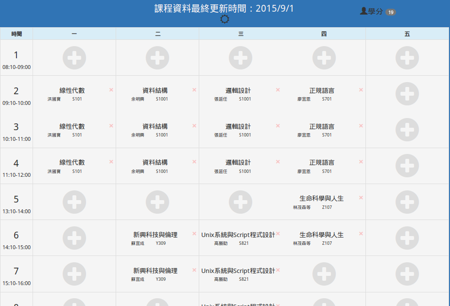
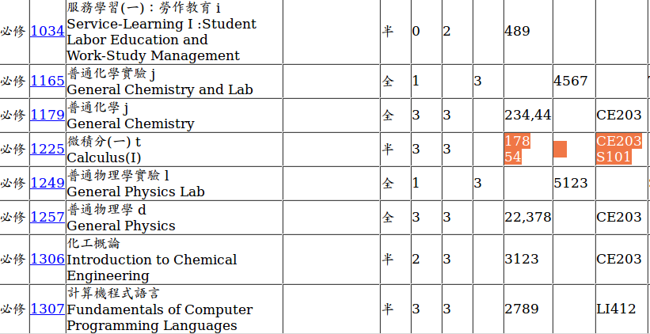
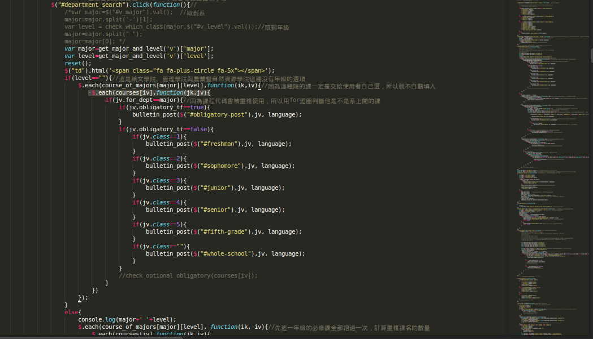

         title: SITCON x NCHUIT 台中定期聚 #12 暨 NCHUIT 期末成果發表
author: 中興資訊社 NCHUIT

%%%%%%%%%%%%%%%%%%%
% Use '%' to comment or directive (ex:css below)

%%%%%%%%%%%%%%%%%%%
%% You can add some custom style rules here...

% for david
% x = 20000 - 40000
% y = 20000 - 40000

%css


%end

%%%%%%%%%%%%%%%%%%%
%% occupation of scale=1:
%% x = 1200
%% y = 700
%% occupation of scale=2: [occupation of scale=1] * 2
%% x = 2400
%% y = 1400
%% occupation of scale=3: [occupation of scale=1] * 3
%% x = 3600
%% y = 2100
%% occupation of scale=4: [occupation of scale=1] * 4
%% ...
%% the location of one step (slide) is originated from the center!

%%%%%%%%%%%%%%%%%%%
%% Here we go...

%%%%%%%%%%%%%%%
!SLIDE x=-20000 y=-20000

### SITCON x NCHUIT 台中定期聚 #12

##### 暨 NCHUIT 期末成果發表


%%%%%%%%%%%%%%%
!SLIDE x=-20000 y=-19300

## 關於今天的定期聚

#### 我們要來趁機成發一下，時間借我們一下吧XDD

%%%%%%%%%%%%%%%
!SLIDE x=-18800 y=-20000

## 首先，從迎新開始

%%%%%%%%%%%%%%%
!SLIDE x=-18800 y=-19300

## 我們做了個首頁

#### [nchuit.cc](http://nchuit.cc)

%%%%%%%%%%%%%%%
!SLIDE x=-18800 y=-18950 z=-350 rotate-x=90

## 我們做了一些遊戲來吸引眼球

#### [首頁上的遊戲](http://nchuit.cc/#index)

#### [ClickClick](http://nchuit.cc/clickclick/)

#### [多人 BlackJack](https://github.com/NCHUIT/blackjack-ws)

%%%%%%%%%%%%%%%
!SLIDE x=-18800 y=-18250 rotate-x=180

## [完全匿名聊天室 (And Hackable)](https://github.com/NCHUIT/talktalk)

#### 但是完全匿名真的太歡樂了...

%%%%%%%%%%%%%%%
!SLIDE picture x=-18800 y=-18250 z=-1400

### 社團博覽會，結果...


%%%%%%%%%%%%%%%
!SLIDE x=-17400 y=-20000

## 依序展示本學期的活動之前，有件事得先弄

### 社團課程期末作業

%%%%%%%%%%%%%%%
!SLIDE picture x=-17400 y=-19300

### 規則

瀏覽一下[社課同學清單](http://juncareasy.com/serker/)，接著在票上寫上你最喜歡的作品作者的名字  


> 有沒有作者要展示的？沒的話我就來瀏覽一下囉  

%%%%%%%%%%%%%%%
!SLIDE x=-16000 y=-20000

## 正式來吧，社課

%%%%%%%%%%%%%%%
!SLIDE picture x=-16000 y=-20000 z=350 rotate-x=90

### 第一主題：HTML & Bootstrap

 * [教材 Repo](https://github.com/NCHUIT/104A_HTML)
 * [HTML 投影片](http://static.pastleo.me/nchuit/104A_HTML/20150924_1_slides.html)、[Bootstrap 投影片](http://static.pastleo.me/nchuit/104A_HTML/社課.pdf)
 * [成品示範](http://static.pastleo.me/nchuit/104A_HTML/demo/personal_website.html)


%%%%%%%%%%%%%%%
!SLIDE x=-16000 y=-17500 z=350 rotate-x=90

### 第二主題：Javascript & jQuery

 * [教材 Repo](https://github.com/NCHUIT/104A_JS)
 * [JS 入門教學](http://static.pastleo.me/nchuit/104A_JS/slide.html)、[JQuery!](http://static.pastleo.me/nchuit/104A_JS/jquery)
 * [成品示範](http://static.pastleo.me/nchuit/104A_JS/demo/boring_notes.html)

> 其實純 JS 的部分是直接抄去年的啊...意思是說以後學弟妹都會用我們寫好的教學的是嗎...

%%%%%%%%%%%%%%%
!SLIDE x=-16000 y=-15000 z=350 rotate-x=90

### 第三主題：Ajax with Google speadsheet

 * [教材 Repo](https://github.com/NCHUIT/104A-Ajax)
 * [投影片](http://static-pl.nchuit.cc/104a-ajax/104A-Ajax.html)
 * [成品示範](http://nyannyan.space/JT2htmlJS.html)

> 簡單來說就是把 Google 試算表當成我們的 API 來練習 Ajax

%%%%%%%%%%%%%%%
!SLIDE x=-16000 y=-12500 z=350 rotate-x=90

### 第四主題：Google speadsheet as DB using app script

 * [投影片](https://goo.gl/3HkJKD)
 * [上課筆記](https://nchuit.hackpad.com/1210Ajax-teC1VRK0mqA)
 * [大概要做這個，不過只是殼](http://juncareasy.com/serker/template.html)
 * [社課小幫手](http://juncareasy.com/serker/) 大量了使用了這堂課所教導的內容

> 既然已經可以寫後端程式...就把試算表當成資料庫來用吧XDD

%%%%%%%%%%%%%%%
!SLIDE picture x=-14600 y=-12500

## 我們的第二軌活動：程式競賽分享會


%%%%%%%%%%%%%%%
!SLIDE picture x=-14600 y=-11800

### 活動狀況


##### 反正就是在電腦教室

%%%%%%%%%%%%%%%
!SLIDE slide showOnlyWhenPresent x=-14600 y=-11450 rotate-x=270

### 看成績好了

| 隊名                         | 成員                 | 題數 |
|------------------------------|----------------------|------|
| 投資理財有風險屁屁買賣沒保險 | 劉冠閎 沈柏瑋 莊士賢 | 3    |
| 宇鈞均YEE隊                  | 王韋鈞 王鈞硯 林軒宇 | 3    |
| sisker                       | 陳盈達 范浩翔 林師漢 | 3    |
| 室友好carry隊                | 張軒譯               | 3    |
| 資工對不隊                   | 洪浩祐 李家駿 劉鴻文 | 3    |
| 程如code所說                 | 張泰瑋 黃翔宇 林佑儒 | 3    |

%%%%%%%%%%%%%%%
!SLIDE slide x=0 y=0 scale=3

## 接下來就是重頭戲了

#### 開工計畫

%%%%%%%%%%%%%%%
!SLIDE picture x=0 y=0 z=-3500 scale=3

### 真的不得不說，這個活動的特點就是...


#### 我們總共吃了 10850 元 ...

%%%%%%%%%%%%%%%
!SLIDE x=5000 y=5000 scale=3

## 來點正式的啦

#### 我們的產出是啥～？

%%%%%%%%%%%%%%%
!SLIDE x=5000 y=5000 z=-3500 scale=3

## 空氣品質網站

#### [網站在此](http://air.nchuit.cc)

#### [Repo 位置](https://github.com/jd615645/Air)

%%%%%%%%%%%%%%%
!SLIDE x=5000 y=5000 z=-7000 scale=3

## 2016 NCHU.ES 清流盃 官方網站

#### [網站在此](http://nchues2016.nchuit.cc)  

#### [Repo 位置](https://github.com/NCHUIT/Nchu2016EsportSite)  

%%%%%%%%%%%%%%%
!SLIDE x=5000 y=5000 z=-10500 scale=3

## 接下來我們來看學生會資訊部在這個活動做了啥

%%%%%%%%%%%%%%%
!SLIDE slide x=20000 y=20000

### 你有沒有覺得學校的選課**很花時間呢**？


%%%%%%%%%%%%%%%
!SLIDE slide x=22000 y=20000

## 我想要排通識，可是不知道什麼時候是**空堂**


%%%%%%%%%%%%%%%
!SLIDE picture x=21400 y=21600

####如果可以像這樣，把我的課表`視覺化`該多好？


%%%%%%%%%%%%%%%
!SLIDE x=29000 y=22000 scale=4

## 所以學長(妹子)就挖坑了  

>我們就傻傻的跳了....

%%%%%%%%%%%%%%%
!SLIDE x=30000 y=32000 rotate=180 scale=4

## 沒有資料要怎麼寫程式阿？

### 學校還沒有api，自己爬吧~


%%%%%%%%%%%%%%%
!SLIDE slide picture showOnlyWhenPresent x=38400 y=32000 rotate=270 scale=10

###因為這隻爬蟲已經有三位學長改過了

###看懂後再改相對輕鬆很多


%%%%%%%%%%%%%%%
!SLIDE slide picture showOnlyWhenPresent x=38400 y=32000 rotate=200 scale=10

####成功產出json囉~~


%%%%%%%%%%%%%%%
!SLIDE picture showOnlyWhenPresent x=33000 y=32000 z=-3000 rotate=300 scale=1

### &nbsp;


%%%%%%%%%%%%%%%
!SLIDE picture x=34400 y=32000 rotate=270 scale=6

#### 怎麼會有**bug**??


%%%%%%%%%%%%%%%
!SLIDE showOnlyWhenPresent x=36700 y=-32000 scale=6

#### 回來看一下json檔，才發現



%%%%%%%%%%%%%%%
!SLIDE x=36300 showOnlyWhenPresent y=-24000 rotate=20 scale=4


%%%%%%%%%%%%%%%
!SLIDE x=37000 showOnlyWhenPresent y=-25000 rotate=40 scale=2

## 眼淚擦一擦，再把爬蟲改一下吧

## 其實就是把`<br/>`取代掉而已 ㄎ

%%%%%%%%%%%%%%%
!SLIDE x=37500 showOnlyWhenPresent y=-16000 z=-100 rotate=60 rotate-x=90 rotate-y=90 rotate-z=90 scale=2

#### 怎麼還是有bug??


%%%%%%%%%%%%%%%
!SLIDE slide x=30000 y=20000 scale=1

#### 同一個**課程代碼**居然有**兩個**課程物件ㄟ！！


%%%%%%%%%%%%%%%
!SLIDE slide x=31200 y=17000 scale=1

要從這樣: `courses[code]`

```
改成這樣ㄟ
$.each( courses[code] , function(ik, iv) {

     //statements
})
```

%%%%%%%%%%%%%%%
!SLIDE slide x=32400 y=10000 scale=1

#### 淦 我都沒有函式化ㄟ  

#### 600多行要怎麼改阿



%%%%%%%%%%%%%%%
!SLIDE slide x=32400 y=10700 scale=1


%%%%%%%%%%%%%%%
!SLIDE slide x=32400 y=16400 scale=1


%%%%%%%%%%%%%%%
!SLIDE picture x=34200 y=10350 z=10000 scale=2

### 到處討拍

### 討完還是要自己改掉拉 QAQ


%%%%%%%%%%%%%%%
!SLIDE center slide x=36600 y=10350 scale=2

## 現在 計中已經已經把資料產成我們要的格式了

## 再也不用怕爬蟲出錯囉

%%%%%%%%%%%%%%%

!SLIDE unclickable showOnlyWhenPresent x=35000 y=12050 scale=5

## 感謝學長們、系上老師和計中


[選課小幫手](http://goo.gl/oL4GBk)

%%%%%%%%%%%%%%%
!SLIDE unclickable showOnlyWhenPresent x=35000 y=22050 scale=5

## What's Next?

* 選課小幫手產出來的個人課表（json）-> Tiagenda

* 選課的時候想要查課程評價怎麼辦？ -> 課程評鑑查詢系統

%%%%%%%%%%%%%%%
!SLIDE picture x=40000 y=40000 scale=5

### 這學期資訊社感謝大家的參與！

  

##### 誒等等！？

%%%%%%%%%%%%%%%
!SLIDE x=45000 y=45000 scale=5

## 社課期末作業投票！

%%%%%%%%%%%%%%%
!SLIDE x=50000 y=50000 scale=5

## 好啦，真的感謝大家的聆聽！

%% The End
%%%%%%%%%%%%%%%
